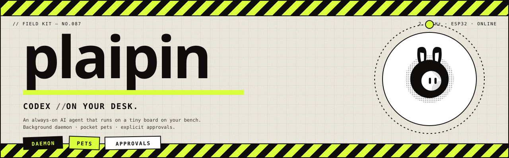

# plaipin

<p align="center">
  
</p>

<p align="center">
  <a href="https://www.npmjs.com/package/plaipin"></a>
  <a href="https://github.com/PlaiPin/plaipin/actions/workflows/ci.yml"></a>
  <a href="https://github.com/PlaiPin/plaipin/blob/main/LICENSE"></a>
  <a href="https://github.com/PlaiPin/plaipin/blob/main/package.json"></a>
  <a href="#requirements"></a>
  <a href="#status"></a>
</p>

Mirror your OpenAI Codex desktop sessions to a small ESP32 device on your local network.

The desktop app's agent activity - status, streaming output, pending approvals - is reflected on the device, and approval prompts can be answered from the device with the desktop UI updating in real time. Animated **Codex Pets** ride along.

## Status

Pre-alpha. The daemon, shim, CLI, and ESP32-facing protocol path are complete and verified end-to-end against the bundled Codex.app.

The device UX implementation is not included in this npm package yet. Display rendering, pet sprites, approval buttons, and the SoftAP captive-portal onboarding flow are still in progress.

## Requirements

- macOS with Codex.app installed at `/Applications/Codex.app`
- Node.js `>=20`
- npm, for global installation
- An ESP32 device/firmware that speaks the plaipin protocol, or `plaipin demo` for no-hardware testing

`plaipin` is distributed as a **CLI-only npm package**. Importing it as a JavaScript library is unsupported; internal compiled modules are intentionally not exported.

## Install

The fastest path is `setup`, which installs the daemon, asks for consent to hook Codex.app, and runs a health check:

```sh
npm install -g plaipin
plaipin setup
```

`setup` prints a bootstrap pairing token for first-device or debug use. Save it somewhere private.

### Codex.app hook

To mirror real Codex.app sessions, plaipin patches `Codex.app/Contents/Info.plist` to set `LSEnvironment.CODEX_CLI_PATH`, then ad-hoc re-signs the app bundle. `plaipin setup` asks before doing this. The change is reversible with `plaipin uninstall`.

After `setup`, quit and reopen Codex.app so macOS reads the new environment value:

```sh
osascript -e 'quit app "Codex"' && open -a Codex
```

## Verify

```sh
plaipin doctor
plaipin tail
```

You can inject a synthetic Codex event sequence without ESP32 hardware:

```sh
plaipin demo
```

## Common Commands

| Command | What it does |
|---|---|
| `plaipin setup` | One-shot install, Codex.app hook, and doctor run. |
| `plaipin install` | Create `~/.plaipin/`, install the shim, write and start the LaunchAgent. |
| `plaipin hook-codex --enable` | Patch Codex.app so real sessions are mirrored. |
| `plaipin hook-codex --disable` | Remove only the Codex.app hook; daemon state remains. |
| `plaipin doctor` | Check install, hook, daemon, and protocol state. |
| `plaipin tail` | Stream ESP32-facing daemon events in a terminal. |
| `plaipin device add <name>` | Pair a device over USB-CDC or wireless claim. |
| `plaipin uninstall` | Restore Codex.app, stop the daemon, and remove plaipin state. |

Without the Codex.app hook, the daemon can still run but only sees its own headless app-server. If `doctor` reports `Codex.app hook` as missing, run `plaipin hook-codex --enable` or re-run `plaipin setup`.

## Security Model

plaipin is designed for a trusted local network.

- Device connections use bearer tokens stored under `~/.plaipin/state/`.
- Paired-device welcomes and revocation frames are MAC-signed with the device token.
- The initial bootstrap token is powerful enough to tail daemon events; treat it as a secret.
- The loopback control API is bound to `127.0.0.1`.
- Uninstalling removes local state unless you pass `--keep-state`.

If a token is exposed, revoke or reset the device and pair again.

## Uninstall / Rollback

Always use `plaipin uninstall`. Do not remove `~/.plaipin` by hand while the hook is installed.

The hook makes Codex.app spawn `~/.plaipin/bin/codex-shim`. If that file is missing while `Info.plist` still points at it, Codex.app can fail to launch with `ENOENT`.

```sh
plaipin uninstall
```

Flags:

- `-y` skips the confirmation prompt.
- `--keep-state` preserves `~/.plaipin/state/` pairings and `~/.plaipin/bin/` shim files for reinstall.

What `uninstall` does, in order:

1. Restores `/Applications/Codex.app/Contents/Info.plist` from `~/.plaipin/state/Info.plist.original` when available.
2. Re-signs Codex.app ad-hoc so Gatekeeper still accepts it.
3. Unloads and removes `~/Library/LaunchAgents/com.plaipin.daemon.plist`.
4. Removes `~/.plaipin` unless `--keep-state` is set.

After uninstalling plaipin state, remove the global npm package if desired:

```sh
npm uninstall -g plaipin
```

### Codex.app Signature

After `hook-codex --enable`, Codex.app is ad-hoc signed instead of signed by Apple's original TeamID. It should still launch and run, but `spctl --assess` may report it as unsigned by Developer ID.

To restore Apple's original signature, reinstall Codex.app from the official DMG or wait for an auto-update that replaces the app bundle.

## Troubleshooting

### Codex.app Does Not Launch

This usually means Codex.app still points at a missing plaipin shim.

```sh
# Option A: put the shim back, then uninstall safely
npm install -g plaipin
plaipin install --no-launchctl --no-hook-codex
plaipin uninstall

# Option B: manually remove the Info.plist key
/usr/libexec/PlistBuddy -c 'Delete :LSEnvironment:CODEX_CLI_PATH' \
  /Applications/Codex.app/Contents/Info.plist
codesign --force --deep --sign - /Applications/Codex.app
```

### Doctor Says The Hook Is Missing

Run:

```sh
plaipin hook-codex --enable
osascript -e 'quit app "Codex"' && open -a Codex
```

### App Management Permission Denied

macOS 13+ may block terminal apps from modifying `/Applications/Codex.app`.

Open System Settings, go to **Privacy & Security** -> **App Management**, add your terminal app, then quit and reopen that terminal before retrying `plaipin hook-codex --enable`.

### Device Does Not Connect

Run:

```sh
plaipin doctor
plaipin device list
plaipin tail
```

If the pairing exists but the device stays offline, check WiFi credentials, local-network reachability, and whether multiple Macs on the LAN are advertising plaipin.

## Architecture

```text
Codex.app (Electron)
   |
   v  CODEX_CLI_PATH=...codex-shim app-server ...      (set by `plaipin hook-codex --enable`)
codex-shim (POSIX shell + small Node bridge)
   |
   v  WebSocket-over-unix-socket frames
unix:///~/.plaipin/run/app-server.sock  <------+
   |                                           |
   v                                           |
codex app-server                               |
   ^                                           |
   | owned & spawned by -----------------------+
   |
plaipind (Node/TS)
   |
   v  WebSocket + bearer
ESP32 device
```

## Layout

```text
src/
  cli/             plaipin CLI (commander)
  daemon/          plaipind long-running daemon
  shared/          protocol types and shared helpers
shim/              codex-shim.sh + codex-shim-bridge.js
scripts/           architectural spikes and dev tooling
```

## Current Limitations

- Startup hydration currently resumes each known thread with a full snapshot. This is robust but slower than an `excludeTurns: true` hydration pass would be on large histories.
- The daemon's snapshot-to-live event model can emit a tentative item completion followed by a live refinement for the same item id.
- Pet `review` state is timer-bounded rather than focus-bounded, because Codex.app focus/navigation events are not visible over the app-server protocol.
- Daily persisted stats and cost calculation are planned but not implemented.
- Consumer-grade SoftAP provisioning is planned; today pairing is USB-CDC or wireless claim, depending on firmware support.

## Build & Develop

```sh
npm install
npm run build
npm run typecheck
npm test
```

For source-checkout testing, run the built CLI directly:

```sh
node dist/cli/index.js --help
node dist/cli/index.js doctor
```

To test the global command locally:

```sh
npm link
plaipin --help
```

To smoke-test the npm artifact shape:

```sh
npm pack
npm install -g ./plaipin-*.tgz
plaipin --help
```

Do not commit packed `.tgz` artifacts.

For an isolated no-hardware demo from a checkout:

```sh
PLAIPIN_HOME=/tmp/plaipin-demo \
PLAIPIN_LAUNCHAGENTS_DIR=/tmp/plaipin-demo/LaunchAgents \
  node dist/cli/index.js install --no-hook-codex --no-launchctl

PLAIPIN_HOME=/tmp/plaipin-demo node dist/daemon/index.js
PLAIPIN_HOME=/tmp/plaipin-demo PLAIPIN_TOKEN=<from above> \
  npx tsx scripts/dev/fake-esp32.ts
```

## License

Licensed under the Apache License, Version 2.0. See [`LICENSE`](LICENSE).
